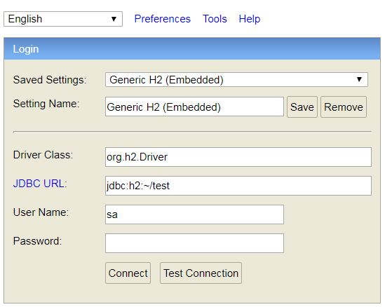
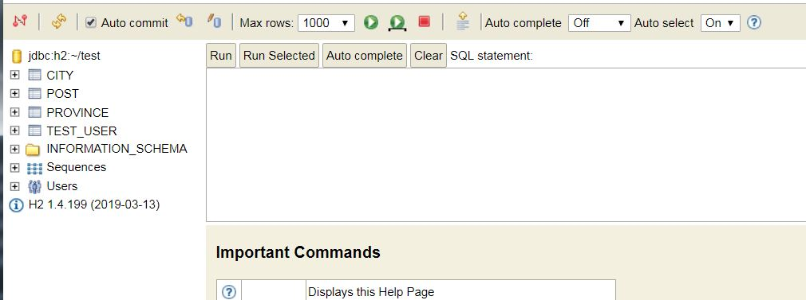

# Spring Boot Web Application Template
Example of JPA Application. Just for the testing purpose, Embedded H2 database is used.

## Environment
* Framework : Spring Boot - 2.1.6
* ORM : JPA / Hibernate
* Database : H2 - h2-2017-04-23
* Unit Test : jUnit + AssertJ
* Code Quality : Jacoco

## Services
* __/testusers__ - `GET` - Returns all test user accounts includes related posts
* __/posts__ - `GET` - Returns all posts
* __/post/{postId}__ - `GET, PUT, DELETE` - GET returns, PUT updates, and DELETE deletes the post 
* __/post__ - `POST` - Add new post

## Initialization

After run the application, connect to `/h2-console` on the browser. Then you will see the following screen. Click connect to login




Once you are logged in, you will see something similar with following screen. 


Run the following SQL to create a table and add some initial test data

#### Create Test Database
```
CREATE TABLE TEST_USER(
    USER_ID VARCHAR(10) PRIMARY KEY,
    PW VARCHAR(20) NOT NULL,
    NAME VARCHAR(20) NOT NULL,
    TITLE VARCHAR(10),
    AGE INT
);

CREATE TABLE POST(
    POST_ID INT AUTO_INCREMENT PRIMARY KEY,
    USER_ID VARCHAR(10),
    SUBJECT VARCHAR(50),
    CONTENT VARCHAR(200),
    CREATED_DATETIME DATETIME,
    FOREIGN KEY (USER_ID) REFERENCES TEST_USER(USER_ID)
);
```

#### Add some test data
```
// Hibernate side test data
INSERT INTO TEST_USER(USER_ID, PW, NAME, TITLE, AGE) VALUES( 'tester1', '1234', 'Brian Heo', 'Sir', 42);
INSERT INTO TEST_USER(USER_ID, PW, NAME, TITLE, AGE) VALUES('tester2', '1234', 'Phil Lee', 'Mr.', 42);
INSERT INTO TEST_USER(USER_ID, PW, NAME, AGE) VALUES('tester3', '1234', 'Gerrard Lee', 43);

INSERT INTO POST(USER_ID, SUBJECT, CONTENT, CREATED_DATETIME) VALUES( 'tester1', 'Test Subject 1', 'Contents of Test subject 1', CURRENT_TIMESTAMP());
INSERT INTO POST(USER_ID, SUBJECT, CONTENT, CREATED_DATETIME) VALUES( 'tester2', 'Test Subject 2', 'Contents of Test subject 2', CURRENT_TIMESTAMP());
INSERT INTO POST(USER_ID, SUBJECT, CONTENT, CREATED_DATETIME) VALUES( 'tester1', 'Test Subject 3', 'Contents of Test subject 3', CURRENT_TIMESTAMP());
INSERT INTO POST(USER_ID, SUBJECT, CONTENT, CREATED_DATETIME) VALUES( 'tester2', 'Test Subject 4', 'Contents of Test subject 4', CURRENT_TIMESTAMP());
INSERT INTO POST(USER_ID, SUBJECT, CONTENT, CREATED_DATETIME) VALUES( 'tester1', 'Test Subject 5', 'Contents of Test subject 5', CURRENT_TIMESTAMP());
INSERT INTO POST(USER_ID, SUBJECT, CONTENT, CREATED_DATETIME) VALUES( 'tester1', 'Test Subject 6', 'Contents of Test subject 6', CURRENT_TIMESTAMP());
INSERT INTO POST(USER_ID, SUBJECT, CONTENT, CREATED_DATETIME) VALUES( 'tester1', 'Test Subject 7', 'Contents of Test subject 7', CURRENT_TIMESTAMP());
INSERT INTO POST(USER_ID, SUBJECT, CONTENT, CREATED_DATETIME) VALUES( 'tester3', 'Test Subject 8', 'Contents of Test subject 8', CURRENT_TIMESTAMP());
INSERT INTO POST(USER_ID, SUBJECT, CONTENT, CREATED_DATETIME) VALUES( 'tester1', 'Test Subject 9', 'Contents of Test subject 9', CURRENT_TIMESTAMP());
```

#### H2 setup - (in application.properties)
* H2 is a embedded Database service. H2 will up and running as long as your application is running by the following dependency in Gradle script.

```
    runtime 'com.h2database:h2'     // Test Database
```

* Database connection setup 
We are using default JPA-Hibernate property names.

```
    # H2
    spring.h2.console.enabled=true
    spring.h2.console.path=/h2-console
    
    # Datasource
    spring.datasource.url=jdbc:h2:file:~/test;DB_CLOSE_ON_EXIT=FALSE
    spring.datasource.username=sa
    spring.datasource.password=
    spring.datasource.driver-class-name=org.h2.Driver
    spring.jpa.properties.hibernate.dialect=org.hibernate.dialect.H2Dialect
    spring.jpa.properties.hibernate,format_sql=true
    spring.jpa.show-sql=true
    spring.jpa.hibernate.naming-strategy=org.hibernate.cfg.DefaultNamingStrategy
```


## Relationship
* Between TestUser and Post
It is One to Many relationship between TestUser and Post

TestUser.java

```java
    ...
    @OneToMany( cascade = CascadeType.ALL, fetch = FetchType.LAZY, mappedBy = "testUser")
    private Set<Post> posts = new HashSet<>();
```
Post.java

```java
    ...
    @ManyToOne(fetch = FetchType.LAZY)
    @JoinColumn(name="user_id", nullable = false)
    @JsonIgnore
    private TestUser testUser;
```
@JsonIgnore is added, so it won't fall into infinite loop when translated to JSON

## Repository methods
Other than specified method below, it uses JPA provided method to use database.

TestUserRepository.java

```
@Repository
public interface TestUserRepository extends CrudRepository<TestUser, Integer>{

    public TestUser findByUserId(String userId);

}
```

PostRepository.java

```
@Repository
public interface PostRepository extends CrudRepository<Post, Integer>{
    
    public Post findByPostId(Integer postId);
}
```


## Unit Testing (TBD)

## Integration Test (TBD)

## Code Quality Check (TBD)

